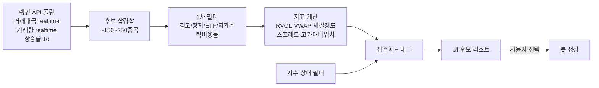
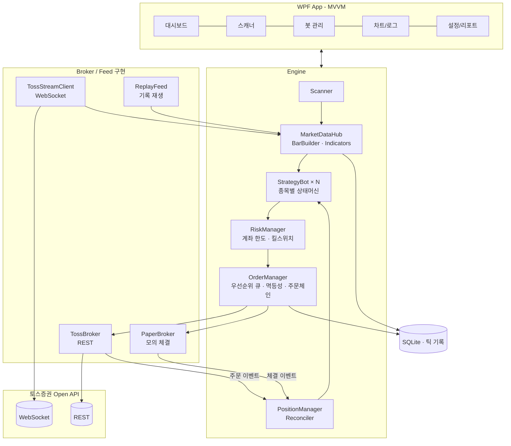
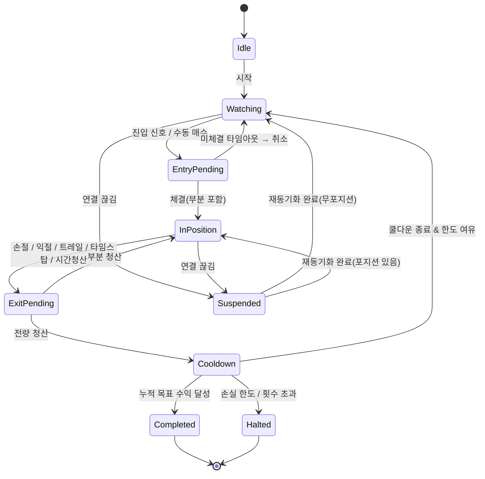
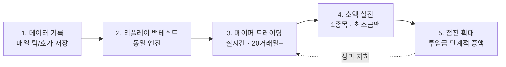

# TossTrading — 컨셉 & 설계 문서 (v0.1)

> 작성일: 2026-09-25 · 대상: 토스증권 Open API 기반 C#/.NET WPF 자동매매 프로그램
> 상태: **초안(설계 방향 합의용)** — 코드 작성 전, 방향과 범위를 확정하기 위한 문서

---

## 0. 한 페이지 요약

| 항목 | 결론 |
|---|---|
| **언어/플랫폼** | **C# / .NET 10(LTS) / WPF** 만으로 100% 구현 가능. 토스 Open API는 REST + WebSocket 이라 **파이썬 불필요**. |
| **원래 컨셉** | 급등주 리스트업 → 사용자가 종목 선택 → 스켈핑 자동매매 → 목표 수익률 도달 시 정지, 여러 종목 동시(종목별 설정) |
| **제안 컨셉** | 컨셉은 유지하되 **"급등주 추격 스켈핑" → "Stocks in Play 모멘텀 데이트레이딩 + 규율 강제 봇"** 으로 무게중심 이동 |
| **왜 바꾸나** | 2026년 증권거래세가 **0.20%** 로 올라서, 수수료·슬리피지까지 합친 **왕복 비용이 약 0.3~0.5%**. 목표 +0.5~1% 짜리 초단타는 구조적으로 기대값이 마이너스가 되기 쉬움 (1장 참고) |
| **핵심 기능 5가지** | ① 종목 스캐너(Stocks in Play) ② 종목별 독립 봇(진입/청산/목표/손실한도 각각 설정) ③ 계좌 레벨 리스크 관리 + 킬스위치 ④ **페이퍼 트레이딩**(토스 API에 모의투자 없음) ⑤ 실시간 데이터 기록 → 리플레이 백테스트 |
| **MVP** | "**수동 진입 + 자동 청산**" 봇 + 스캐너 + 페이퍼 트레이딩. 자동 진입 전략은 그 다음 단계에 붙임 |
| **실전 투입 기준** | 페이퍼 20거래일 이상, 100회 이상 거래, **비용 차감 후** 기대값 > 0, 최대낙폭 한도 이내 → 소액 실전 → 점진 확대 |

---

## 1. 먼저 솔직한 이야기 — "확실히 수익을 내는 방향"에 대해

### 1.1 확실한 수익은 없다. 대신 "엣지를 찾고, 검증하고, 규율을 강제하는" 도구는 만들 수 있다

- 브라질 데이트레이더 1.9만 명을 추적한 연구(Chague et al., 2019)에서 **300일 이상 지속한 사람의 97%가 손실**을 봤습니다.
- 대만 전수 데이터 연구(Barber et al.)에서도 **비용 차감 후 꾸준히 이익을 내는 데이트레이더는 1% 미만**이었습니다.
- 반면, "평소보다 거래가 폭증한 종목(**Stocks in Play**)만 골라 **시가 범위 돌파(ORB)** 로 거래"하는 규칙 기반 전략은 미국 시장 2016~2023 백테스트에서 비용 차감 후에도 양호한 성과를 보였다는 연구(Zarattini, Barbon, Aziz, 2024)가 있습니다.
  - 단, 미국 시장 결과이고(거래세 없음) 백테스트는 미래를 보장하지 않습니다. **우리 시장·우리 비용으로 재검증**해야 합니다.

**시사점:** 개인이 이기기 어려운 이유는 대부분 ① 비용 ② 추격매수 ③ 손절 불이행 ④ 과잉매매입니다.
그래서 이 프로그램이 돈을 버는 방식은 "마법의 신호"가 아니라:

1. **좋은 판에만 참여**: 거래대금·상대거래량이 폭증한 종목만, 좋은 시간대에만 (스캐너)
2. **비용보다 충분히 큰 움직임만 노림**: 목표 수익이 왕복 비용의 3배 미만이면 경고 (비용 가드)
3. **손실을 기계적으로 자름**: 손절·타임스탑·일손실한도를 사람이 못 끄게 (리스크 엔진)
4. **데이터로 검증**: 모든 틱/체결을 기록하고, 같은 코드로 리플레이·페이퍼 검증 후에만 실전 (검증 파이프라인)

### 1.2 비용 구조 — 왜 "초단타 스켈핑"이 불리한가

국내 주식 1회 왕복(매수→매도) 비용:

| 항목 | 값 | 비고 |
|---|---|---|
| 매매 수수료 | 약 0.015% × 2 | 토스 정책/이벤트에 따라 다름 → API `Commissions` 로 조회해 자동 반영 |
| 증권거래세 (매도 시) | **0.20%** | 2026년~ 코스피 0.05%+농특세 0.15%, 코스닥 0.20% |
| 슬리피지 | 호가 1틱 × 2 (가정) | 가격 10,000원 종목이면 1틱 = 10원 = 0.1% → 왕복 0.2% |
| **합계** | **약 0.43%** | 가격대·호가 두께에 따라 0.3~0.6% |

> 호가단위/가격 비율(**틱 비용률**)이 가격대에 따라 크게 다릅니다.
> 예) 1,990원(틱 1원) = 0.05%, 2,000원(틱 5원) = 0.25%, 19,990원(틱 10원) = 0.05%, 20,000원(틱 50원) = 0.25%.
> → 스캐너에서 **틱 비용률이 높은 종목은 감점/제외**합니다.

**기대값 공식:** `E = 승률 × 평균이익 − (1 − 승률) × 평균손실 − 왕복비용`

| 시나리오 (예시 수치) | 승률 | 평균이익 | 평균손실 | 왕복비용 | **거래당 기대값** |
|---|---|---|---|---|---|
| 초단타 스켈핑 | 60% | +0.6% | −0.6% | 0.43% | **−0.31%** ❌ |
| 일반 스켈핑 | 50% | +1.0% | −0.7% | 0.43% | **−0.28%** ❌ |
| 모멘텀 데이트레이딩 | 40% | +3.0% | −1.2% | 0.43% | **+0.05%** △ |
| 모멘텀 + 좋은 필터 | 45% | +3.0% | −1.2% | 0.43% | **+0.26%** ✅ |

→ 승률이 높아도 **이익폭이 작으면 비용에 다 먹힙니다.** 승률보다 **손익비(평균이익/평균손실)와 비용 대비 목표폭**이 핵심입니다.
→ 그래서 스켈핑 "모드"는 지원하되, 기본 추천은 **수 분~수 시간 보유, 목표 2R 이상의 모멘텀 데이트레이딩**입니다.

### 1.3 기술적 현실 — 토스 API로 "초고속 스켈핑"은 경쟁력이 낮다

- 주문 호출 한도: 초당 약 6회, **장 시작 09:00~09:10은 초당 약 3회** (3장 참고)
- 실시간 시세는 WebSocket이지만 **LOSSY(밀리면 중간 이벤트 버림)** 구조
- 분봉은 **1분봉만** 제공 (3분/5분봉은 직접 만들어야 함), **호가/틱 과거 데이터는 없음**

→ 초 단위 경쟁(전업 스캘퍼, 증권사 알고리즘)에서 이기려는 설계는 피하고, **분 단위 의사결정 + 규율 있는 청산**에 집중하는 게 맞습니다.

---

## 2. 제안 컨셉

### 2.1 원안 vs 제안

| | 원안 | 제안 |
|---|---|---|
| 종목 선정 | 급등주 리스트업 | **Stocks in Play 스캐너**: 거래대금·상대거래량(RVOL)·등락률·체결강도·틱 비용률·경고종목 필터 → 점수화 |
| 진입 | 스켈핑 | **구조적 진입 프리셋**: ORB(시가범위 돌파), VWAP 눌림 재돌파, 당일 고가 돌파, **수동 진입** |
| 청산 | 목표 수익률 도달 시 정지 | 손절 / 분할 익절 / 트레일링 / 본절 이동 / **타임스탑** / 장마감 청산 — 모두 종목별 설정 |
| "목표 도달 시 정지" | 1단계 | **3단계**: ① 거래 단위 익절 ② 종목(봇) 누적 목표 도달 시 봇 종료 ③ 계좌 일 목표/일 손실 한도 도달 시 전체 신규진입 중지 |
| 다종목 | 동시 실행, 각각 설정 | 동일 + **프리셋**(설정 묶음) + 계좌 레벨 총 노출/동시 포지션 한도 |
| 검증 | - | **페이퍼 트레이딩 필수** + 실시간 데이터 기록 → 리플레이 백테스트 |

### 2.2 운용 모드 (사용자가 종목별로 선택)

| 모드 | 진입 | 청산 | 용도 |
|---|---|---|---|
| **A. 수동진입·자동관리** (MVP) | 사용자가 [매수] 클릭 | 봇이 손절/익절/트레일링/타임스탑 실행 | 가장 먼저 효과를 봄. "손절 못 하는 문제"를 즉시 해결 |
| **B. 반자동** | 봇이 신호 → 알림 → 사용자 승인 클릭 | 자동 | 전략 신뢰도를 쌓는 단계 |
| **C. 완전자동** | 봇이 신호 시 즉시 주문 | 자동 | 페이퍼·소액 검증 통과한 전략만 허용 |

그리고 모든 모드는 **Paper(모의) / Live(실전)** 스위치를 가집니다. 기본값은 Paper.

### 2.3 사용 흐름 (하루)

```
08:30  프로그램 실행 → 토큰 발급, 계좌/예수금 동기화, 전일 데이터(일봉 20일) 캐시
08:50  시장 상태 확인(코스피/코스닥 지수), 오늘의 리스크 한도 확인
09:00  스캐너 가동: 거래대금/거래량/상승률 랭킹 폴링 → 후보 점수화 → 리스트 갱신
09:05~ 사용자가 후보에서 종목 선택 → 프리셋 적용(또는 개별 수정) → [봇 시작]
       ├─ 종목 A: ORB 전략, 투입 200만, 손절 -1.5%, 목표 누적 +3% 시 종료
       ├─ 종목 B: VWAP 눌림, 투입 150만, 트레일링 1.2%
       └─ 종목 C: 수동 진입, 자동 청산만
~11:00 (설정 시) 신규 진입 종료. 보유분은 청산 규칙대로 관리
15:10  잔여 포지션 강제 청산(옵션) → 일일 리포트 생성
```

---

## 3. 토스증권 Open API 분석 — 설계에 영향을 주는 사실들

> ⚠️ 이 문서를 작성한 개발 환경에서 `developers.tossinvest.com` 접근이 네트워크 정책으로 차단되어,
> 비공식 SDK(`toss-go`) 문서와 공개 가이드 글을 교차 확인해 정리했습니다.
> **★ 표시 항목은 구현 착수 전 공식 문서로 재확인**이 필요합니다.

### 3.1 기본

| 항목 | 내용 |
|---|---|
| Base URL | REST `https://openapi.tossinvest.com`, WebSocket `wss://openapi-ws.tossinvest.com/ws/v1` |
| 인증 | OAuth 2.0 **Client Credentials** — `POST /oauth2/token` (client_id / client_secret) → Bearer 토큰 |
| 토큰 수명 | 약 1시간(`expires_in`) → **만료 10분 전 선제 갱신** |
| 키 발급 | 토스증권 WTS → 설정 → Open API 에서 client_id / client_secret 발급 |
| **허용 IP** | 설정 → Open API → 허용 IP 관리에 **호출 PC의 공인 IPv4 등록 필수**. 미등록 시 403 (`ip-not-allowed`) |
| 계좌 지정 | `GET /api/v1/accounts` 로 `accountSeq` 조회 → 계좌/주문 API에 계좌 헤더(★`X-Tossinvest-Account`)로 전달 |
| 모의투자 | **API용 샌드박스/모의계좌 없음** → **자체 Paper Broker 필수** |
| 시장 | 국내(KOSPI/KOSDAQ, KRX+NXT 통합 시세), 미국(NYSE/NASDAQ/AMEX) |
| ★ mTLS | 일부 글에서 mTLS 인증서(유효 390일) 언급 — 공식 문서 확인 필요 |

### 3.2 주요 엔드포인트와 설계 반영

| 분류 | 엔드포인트 | 제약 | 설계 반영 |
|---|---|---|---|
| 현재가 | `GET /api/v1/prices` | 1회 최대 200종목 | 스캐너 후보군 일괄 폴링 |
| 호가 | `GET /api/v1/orderbook` | 단일 종목 | 진입 직전 스프레드 확인 (실시간은 WS) |
| 체결 | `GET /api/v1/trades` | 최대 50건 | 재연결 후 공백 보정 |
| 캔들 | `GET /api/v1/candles` | **간격 `1m`, `1d` 만**, 1회 최대 200개, `before` 페이징 | 3분/5분봉은 **1분봉에서 합성**. 틱 과거 데이터 없음 → **자체 기록** |
| 상하한가 | `GET /api/v1/price-limits` | | 주문가 클램핑 |
| 랭킹 | `GET /api/v1/rankings` | 타입: `MARKET_TRADING_AMOUNT`, `MARKET_TRADING_VOLUME`, `TOP_GAINERS`, `TOP_LOSERS`, `TOSS_SECURITIES_TRADING_AMOUNT/VOLUME` · 기간: `realtime`, `1d`… · 최대 100개 · **상승률은 `realtime` 미지원(→`1d`)** · 투자주의 제외 옵션 | 스캐너의 1차 후보 소스 |
| 종목정보 | `GET /api/v1/stocks`(≤200), `/stocks/all`(초당 1회), `/stocks/{symbol}/warnings` | 경고: 투자경고/위험/과열/정리매매/**VI(정적·동적)** | 위험 종목 필터, VI 중 진입 보류 |
| 수급 | `/stocks/{symbol}/investor-trading`, `program-trades`, `short-selling`, `credit-trades` | 국내만, 일 단위 | 스캐너 보조 지표(선택) |
| 지수 | 지수 현재가/캔들 | 일/주/월/년 | 시장 상태 필터 |
| 보유/평가 | `GET /api/v1/holdings` | | 포지션 동기화 |
| 주문 | 생성(수량/★금액-미국만) · 정정 · 취소 · 목록(OPEN/CLOSED) · 단건 · 매수가능금액 · 매도가능수량 · 수수료 | `LIMIT`/`MARKET`, TIF `DAY`/`OPG`(국내)/`CLS`(미국) · **1억원 이상은 `confirmHighValue=true` 필요** | OrderManager (3.4 참고) |
| 조건주문 | `POST/GET/DELETE /api/v1/conditional-orders`, `POST …/{id}/modify` | `SINGLE`/`OCO`/`OTO`, 조건 `STOP`(가격) · **국내는 KRX 정규장에서만 감시** | **서버측 안전망 손절** (7.4 참고) |
| 시장정보 | 환율, KR/US 마켓 캘린더 | | 휴장일/조기폐장 처리 |

### 3.3 호출 한도 (Rate Limit) ★

- **클라이언트 × API 그룹** 단위 초당 제한. 초과 시 `429` + `Retry-After` 헤더, 현재 한도는 `X-RateLimit-Limit` 헤더.
- 공개 자료 기준 대략치 (자료마다 수치가 달라 **설정값으로 관리 + 응답 헤더로 자동 보정**):

| 그룹 | 대략 한도 | 비고 |
|---|---|---|
| 주문(ORDER) | 초당 ~6회, **09:00~09:10 초당 ~3회** | 가장 빡빡함 → 우선순위 큐 필수 |
| 시세(MARKET_DATA) | 초당 ~15회 | 스캐너 폴링 예산 |
| 계좌(ACCOUNT) | 초당 ~1회 | 계좌 목록 등 |
| 종목 전체목록 | 초당 1회 | 하루 1회 캐시 |

### 3.4 주문 API 특성 → 설계 반영

| 특성 | 설계 반영 |
|---|---|
| `clientOrderId` 로 **멱등성 보장(10분)** | 모든 주문에 GUID 기반 clientOrderId 부여. 타임아웃 시 **같은 ID로 재전송** → 중복주문 사고 방지 |
| **정정(Modify) 시 새 orderId 발급** | 주문을 "주문 체인"으로 추적 (원주문 → 정정1 → 정정2) |
| 정정은 주문 호출 1회 | 손절 시 "익절 대기주문 취소 → 신규 매도"(2회) 대신 **익절 주문을 공격적 가격으로 정정**(1회) → 호출 절약·지연 감소 |
| 1억 이상 확인 플래그 | 설정에서 1회 주문 상한을 1억 미만으로 기본 제한 |
| 소수점 수량 | 미국 매도만. 국내는 정수 수량 |

### 3.5 WebSocket 특성 → 설계 반영

| 특성 | 설계 반영 |
|---|---|
| **계정당 동시 연결 2개**, 초과 시 **가장 오래된 연결이 끊김** | 프로그램 **단일 인스턴스 강제**(Mutex). 연결 #1 = 내 주문 이벤트 + 봇 종목 시세, 연결 #2 = 스캐너 후보 체결 시세 |
| 연결당 구독 **100개**(채널×종목) | 봇 종목: 체결+호가(2개/종목) → 최대 ~45종목 / 스캐너: 체결만 → ~90종목 |
| 구독 선언 **초당 5회**, 선언형(전체 교체) | 구독 변경을 100ms 단위로 모아서(coalesce) 한 번에 선언 |
| 체결/호가 = **LOSSY** | 틱으로 만든 봉은 **REST 1분봉으로 주기 보정**(마감된 봉은 REST 값이 정답) |
| 내 주문 이벤트 = 세션 내 LOSSLESS, **재연결 시 누락분 재전송 없음** | 재연결 직후 **REST로 미체결/체결/보유 재동기화(Reconcile)** 할 때까지 봇 일시정지 |
| 핑 60초 권장, 180초 무응답 시 서버가 끊음 | Keepalive 핑 + 지수 백오프 재연결(1s→30s) |

### 3.6 "파이썬 없이 되나?" → **됩니다**

토스 API는 언어 중립적인 REST(JSON) + WebSocket 입니다. .NET 기본 제공 기능으로 전부 커버됩니다.

| 필요 기능 | .NET 구성요소 |
|---|---|
| REST 호출/재시도 | `HttpClient` + `IHttpClientFactory` + `Microsoft.Extensions.Http.Resilience`(Polly) |
| 호출 한도 제어 | `System.Threading.RateLimiting.TokenBucketRateLimiter` (기본 제공) |
| WebSocket | `System.Net.WebSockets.ClientWebSocket` |
| JSON | `System.Text.Json` (소스 생성기) |
| 이벤트 파이프라인 | `System.Threading.Channels` |
| 지표 계산 | 직접 구현(VWAP/EMA/ATR 등은 수십 줄) |

---

## 4. 거래 비용 모델 (전 모듈 공통)

```
왕복비용% = 매수수수료% + 매도수수료% + 거래세%(매도)
          + 슬리피지틱 × (호가단위 / 가격) × 2
손익분기 이동폭% = 왕복비용%
```

- 수수료율은 API로 조회, 거래세는 시장별 설정값(세법 변경 대비).
- **비용 가드**: 봇 설정의 1차 목표 수익률 < 왕복비용 × 3 이면 설정 화면에 경고, 완전자동 모드는 시작 차단(옵션).
- 모든 손익 표시는 **"비용 차감 후(Net)"** 기준이 기본.

**국내 호가단위 (KOSPI/KOSDAQ 공통, 2023~)**

| 가격 | 호가단위 |
|---|---|
| ~ 2,000원 미만 | 1원 |
| 2,000 ~ 5,000원 미만 | 5원 |
| 5,000 ~ 20,000원 미만 | 10원 |
| 20,000 ~ 50,000원 미만 | 50원 |
| 50,000 ~ 200,000원 미만 | 100원 |
| 200,000 ~ 500,000원 미만 | 500원 |
| 500,000원 이상 | 1,000원 |

→ `TickSize` 값 객체로 구현, 모든 주문가는 **호가단위로 반올림 + 상하한가 클램핑** 후 전송.

---

## 5. 스캐너 (종목 발굴) 설계

### 5.1 파이프라인



- 폴링 주기: 랭킹 3~5초, 현재가 일괄(200종목/회) 2~3초 → 시세 그룹 한도(초당 ~15회)의 절반 이하만 사용
- 상위 후보(~90종목)는 WebSocket 체결 구독으로 전환해 실시간 지표 계산

### 5.2 필터 (기본값 예시, 모두 사용자 설정 가능)

| 필터 | 기본값 | 이유 |
|---|---|---|
| 증권 유형 | 보통주(STOCK)만, ETF/ETN/워런트 제외 | 레버리지·괴리 리스크 |
| 경고 종목 | 투자경고/위험/과열/정리매매/거래정지 **제외** | 급변·거래제한 |
| 가격 | 1,000원 이상 | 동전주 변동·호가 문제 |
| 등락률 | +3% ~ +20% | 너무 낮으면 모멘텀 부족, 너무 높으면(상한가 근접) 추격 위험 |
| 당일 거래대금 | 시간 보정 기준 ≥ 50억(09:30 기준) | 유동성, 슬리피지 |
| RVOL(상대거래량) | ≥ 3.0 | "Stocks in Play" 핵심 조건 |
| 틱 비용률 | ≤ 0.15% | 비용 (4장) |
| 스프레드 | ≤ 2틱 | 체결 비용 |
| VI 발동 중 | 진입 후보에서 일시 제외 | 단일가 2분, 체결 불확실 |

### 5.3 지표 정의

| 지표 | 계산 |
|---|---|
| **RVOL** | 오늘 누적 거래량 ÷ (20일 평균 일거래량 × 장중 경과 비율 곡선) — 20일 일봉은 장 시작 전 캐시 |
| **VWAP** | Σ(가격×거래량) ÷ Σ거래량 — 늦게 켜도 1분봉(대표가×거래량)으로 복원 |
| **체결강도** | 매수 주도 체결량 ÷ 매도 주도 체결량 × 100 (체결가 ≥ 매도1호가 → 매수 주도, tick rule 보조) |
| **고가 대비 위치** | (현재가 − 당일저가) ÷ (당일고가 − 당일저가) |
| **ORB 범위** | 09:00~09:05(설정) 고가/저가 |
| **ATR(1m,14)** | 손절폭·트레일링 폭 산정용 |

### 5.4 점수 (초기안 — 검증 후 조정)

```
Score = 0.30·norm(RVOL) + 0.20·norm(거래대금) + 0.15·norm(체결강도)
      + 0.15·(VWAP 위 여부 & 거리 적정성) + 0.10·(고가 근접도)
      − 0.10·norm(틱비용률 + 스프레드)
태그: [ORB 대기] [VWAP 근접] [신고가 근접] [VI주의] [과열근접] 등
```

- **시장 상태 필터**: 코스닥 지수 −1.5% 이하 등 약세장에서는 점수 패널티 + 권장 투입금 축소 표시
- 점수는 "추천"일 뿐, 선택은 사용자 (원안 유지)

---

## 6. 전략 설계

### 6.1 진입 전략 프리셋 (플러그인 구조)

| 프리셋 | 조건 (요약) | 손절 기준 | 비고 |
|---|---|---|---|
| **ORB-5** | 09:05 이후, 5분 범위 고가를 거래량 동반 돌파, RVOL 높음, VWAP 위 | 범위 저가 또는 1×ATR | 연구 근거가 있는 기본 전략 |
| **VWAP 눌림 재돌파** | 상승 후 VWAP 부근까지 조정 → 체결강도 회복하며 직전 1분봉 고가 돌파 | VWAP 하회 | 추격 대신 눌림에서 진입 |
| **당일 고가 돌파** | 횡보(N분 박스) 후 당일 고가 돌파 + 거래량 급증 | 박스 하단 | 상한가 근접 종목 제외 |
| **수동 진입** | 사용자 클릭 | 설정 % 또는 가격 | MVP 기본 |

> 진입 주문은 기본 **"공격적 지정가"**: 매도1호가 + k틱(기본 1틱, 상한가 클램핑). N초(기본 3초) 내 미체결 시 취소 또는 1회 정정.
> 순수 시장가는 호가가 얇은 급등주에서 슬리피지 폭탄이 될 수 있어 옵션으로만 제공.

### 6.2 청산 규칙 (조합 가능)

| 규칙 | 동작 |
|---|---|
| **손절** | 가격/%/ATR 배수/구조적(범위 저가, VWAP) 중 선택. 도달 시 **최우선 순위**로 공격적 매도 |
| **분할 익절** | 예: +1R에서 50% 매도 |
| **본절 이동** | +1R 도달 시 손절가를 "매입가 + 왕복비용"으로 상향 |
| **트레일링** | 활성화 조건(+1.5%) 이후 최고가 대비 −x% 또는 −n×ATR |
| **타임스탑** | 진입 후 N분 내 +0.5R 미달 시 청산 (모멘텀 실패 판정) |
| **시간 청산** | 지정 시각(기본 15:10) 전량 청산 — 데이트레이딩 원칙 |
| **이벤트 청산** | VI 해제 직후 급락, 체결강도 급락 등 (2단계) |

### 6.3 종목별 설정 (= "각각 설정")

| 그룹 | 항목 | 기본값 예시 |
|---|---|---|
| 자금 | 사이징 방식 | **리스크 기반**(거래당 계좌의 0.5% 손실) / 고정 금액 |
| | 종목 최대 투입금 | 2,000,000원 |
| 진입 | 전략 프리셋 | ORB-5 |
| | 운용 모드 | 수동진입·자동관리 / 반자동 / 완전자동 |
| | 진입 주문 방식 | 매도1호가+1틱, 3초 미체결 시 취소 |
| | 신규 진입 허용 시간 | 09:05 ~ 11:00 |
| 청산 | 손절 | −1.5% 또는 구조적 |
| | 분할 익절 | +2.0%에서 50% |
| | 트레일링 | +1.5% 이후 고점 대비 −1.2% |
| | 타임스탑 | 20분 |
| | 강제 청산 시각 | 15:10 |
| **목표/정지** | **거래 단위 목표** | +3.0% (또는 2R) |
| | **봇 누적 목표 수익률** | +3.0% (실현, Net) 도달 시 **봇 종료(Completed)** |
| | 봇 누적 손실 한도 | −2.0% 도달 시 **봇 정지(Halted)** |
| | 최대 진입 횟수 | 3회/일 |
| | 재진입 쿨다운 | 5분 |

**프리셋 기능**: 위 설정 묶음을 "공격형/표준/보수형" 등으로 저장 → 종목 선택 시 한 번에 적용, 필요한 항목만 개별 수정.

---

## 7. 리스크 관리 (가장 중요한 모듈)

### 7.1 포지션 사이징 — 리스크 기반

```
수량 = floor( (계좌평가액 × 거래당리스크%) ÷ (진입가 − 손절가) )
예) 계좌 1,000만 × 0.5% = 5만원 리스크, 손절폭 2%(10,000원 종목 → 200원)
    → 250주(250만원). 단, 종목 최대 투입금·매수가능금액으로 상한
```

→ 손절폭이 넓은 종목은 자동으로 적게, 좁은 종목은 많이 삽니다. 거래 하나가 계좌를 망가뜨리지 않게 하는 핵심 장치.

### 7.2 계좌 레벨 한도 (모든 봇 위의 상위 규칙)

| 한도 | 기본값 | 초과 시 |
|---|---|---|
| 일 손실 한도 (Net) | 계좌의 −1.5% | **전체 신규 진입 중지** (+옵션: 전량 청산) |
| 일 목표 수익 | 계좌의 +2.0% (옵션) | 신규 진입 중지, 보유분은 트레일링 유지 |
| 동시 보유 종목 수 | 4 | 신규 진입 차단 |
| 총 노출 한도 | 계좌의 60% | 신규 진입 차단 |
| 1회 주문 상한 | 1억 미만 | 주문 거부 |
| 연속 손실 | 4연패 | 30분 전체 쿨다운 |
| 주문 오류 연속 | 3회 | 해당 봇 정지 + 알림 |

### 7.3 킬스위치 & 장애 대응

- **킬스위치 버튼**(단축키 포함): 전 봇 정지 → 미체결 전량 취소 → (선택) 보유 전량 시장가 청산
- WebSocket 끊김: 봇 **Suspend** → 재연결 → REST 재동기화 → 상태 일치 확인 후 **Resume**
- 토큰/IP 오류(401/403): 신규 주문 중지 + 알림 (보유분 관리는 가능한 범위에서 계속)
- 429: `Retry-After` 존중, 주문 우선순위 큐에서 손절 우선 처리
- 프로그램 재시작 시: 로컬 DB의 봇 상태 + REST 보유/미체결을 대조해 **복구 모드**로 시작 (자동 재진입 안 함)

### 7.4 서버측 안전망 — 조건주문 활용 (★검증 필요)

PC 다운·네트워크 단절 시에도 손실이 무한정 커지지 않도록:

- 진입 체결 직후, **봇 손절선보다 조금 더 넓은 "재앙 손절"** 을 토스 **조건주문(STOP)** 으로 서버에 걸어둠
- 봇이 정상 청산할 때는 조건주문을 먼저 취소 → 청산
- 확인 필요: 조건주문이 매도가능수량을 선점하는지, 트리거 지연, KRX 정규장 외(NXT 시간대) 미작동 → 확인 결과에 따라 On/Off 옵션으로 제공

### 7.5 주문 우선순위 큐 (주문 한도 초당 ~6회, 개장 10분 ~3회)

| 우선순위 | 종류 |
|---|---|
| P0 | 킬스위치 청산, 손절 매도 |
| P1 | 취소 / 정정 |
| P2 | 익절·트레일링 매도 |
| P3 | 신규 진입 |

- `TokenBucketRateLimiter` 1개를 모든 봇이 공유, **P0용 토큰 1개/초 예약**
- 09:00~09:10에는 자동으로 한도를 낮추고 P3 신규 진입을 억제

---

## 8. 소프트웨어 아키텍처

### 8.1 기술 스택

| 영역 | 선택 |
|---|---|
| 런타임 | **.NET 10 (LTS)**, C# 14 |
| UI | **WPF + MVVM** (`CommunityToolkit.Mvvm`) |
| 호스팅/DI/설정 | `Microsoft.Extensions.Hosting` (Generic Host를 WPF에 통합), `IOptions<T>` |
| 차트 | **ScottPlot 5 (WPF)** — 1분봉 캔들 + VWAP + 진입/청산 마커 |
| HTTP | `IHttpClientFactory` + `Microsoft.Extensions.Http.Resilience` |
| 실시간 | `ClientWebSocket` + `System.Threading.Channels` |
| 저장 | **SQLite** (`Microsoft.Data.Sqlite` + Dapper) — 주문/체결/봇상태/일일성과, 틱 기록은 날짜별 압축 파일 |
| 로깅 | Serilog (파일 + UI 로그 패널) |
| 비밀정보 | client_secret은 **Windows DPAPI**(`ProtectedData`)로 암호화 저장 |
| 테스트 | xUnit — 호가단위/비용/사이징/상태머신/페이퍼 체결 로직 단위 테스트 |
| 알림(선택) | 텔레그램 봇 (체결·손절·킬스위치·장애) |

### 8.2 솔루션 구조

```
TossTrading.sln
├─ src/
│  ├─ TossTrading.Domain/     순수 도메인: Symbol, Price, TickSize, Order, Position, CostModel, 설정 모델
│  ├─ TossTrading.Toss/       토스 어댑터: TokenManager, TossRestClient, TossStreamClient, DTO, RateLimit
│  ├─ TossTrading.Engine/     MarketDataHub, BarBuilder, Indicators, Scanner, StrategyBot, OrderManager,
│  │                          PositionManager, RiskManager, PaperBroker, Reconciler
│  ├─ TossTrading.Storage/    SQLite 저장소, TickRecorder(틱/호가 기록)
│  ├─ TossTrading.Backtest/   기록 데이터 리플레이 → 동일 엔진으로 백테스트 (CLI)
│  └─ TossTrading.App/        WPF (Views, ViewModels), Generic Host, DI 구성
└─ tests/
   ├─ TossTrading.Domain.Tests/
   └─ TossTrading.Engine.Tests/
```

**원칙**
- `Domain`/`Engine` 은 UI·토스 API에 의존하지 않음 → 테스트·백테스트에서 그대로 재사용
- **Live/Paper/Backtest가 같은 엔진 코드**를 사용하고, 바뀌는 건 `IBroker`·`IMarketDataFeed` 구현뿐

### 8.3 컴포넌트 구성도



### 8.4 스레딩/이벤트 모델

- **WebSocket 수신 스레드** → `Channel<MarketEvent>`(bounded, DropOldest) → **MarketDataHub**
- MarketDataHub가 종목별로 분배 → **봇마다 전용 Channel + 단일 소비 Task (Actor 방식)**
  - 한 봇의 로직은 항상 한 스레드에서 순차 실행 → 락 불필요, 경쟁 조건 제거
- 주문은 `OrderManager` 단일 큐로 직렬화 (Rate Limiter 공유)
- **UI 갱신은 100ms 단위로 스로틀** (`DispatcherTimer`가 ViewModel 스냅샷을 끌어감) → 틱 폭주에도 UI 멈춤 없음
- 가격·수량은 전부 `decimal`

### 8.5 봇 상태 머신



### 8.6 핵심 인터페이스 (스케치)

```csharp
// Live(토스) / Paper(모의) 공통 — 엔진은 이 인터페이스만 안다
public interface IBroker
{
    Task<OrderAck> PlaceAsync(PlaceOrder request, CancellationToken ct);
    Task<OrderAck> ModifyAsync(string orderId, ModifyOrder request, CancellationToken ct);
    Task CancelAsync(string orderId, CancellationToken ct);
    ChannelReader<OrderEvent> OrderEvents { get; }
    Task<AccountSnapshot> GetAccountSnapshotAsync(CancellationToken ct); // 보유·미체결·예수금
}

// Live(WebSocket) / Replay(기록 재생) 공통
public interface IMarketDataFeed
{
    ValueTask SetSubscriptionsAsync(IReadOnlyCollection<FeedSubscription> subs, CancellationToken ct);
    ChannelReader<MarketEvent> Events { get; }   // TradeTick, OrderBookSnapshot, Reconnected
}

// 진입/청산 전략은 플러그인
public interface IEntrySignal
{
    string Name { get; }
    EntryDecision Evaluate(SymbolContext ctx);             // 틱/봉 마감마다 호출
}

public interface IExitRule
{
    ExitDecision Evaluate(SymbolContext ctx, Position position);
}

public sealed record PlaceOrder(
    string Symbol, OrderSide Side, OrderType Type, decimal Quantity, decimal? Price,
    string ClientOrderId, OrderPriority Priority, string BotId);

public enum BotState { Idle, Watching, EntryPending, InPosition, ExitPending,
                       Cooldown, Suspended, Completed, Halted }
```

### 8.7 토스 어댑터 세부

| 컴포넌트 | 책임 |
|---|---|
| `TokenManager` | 토큰 발급·캐시, 만료 10분 전 갱신, 동시 요청 시 단일 갱신(SemaphoreSlim), 401 시 1회 재발급 |
| `RateLimitHandler` (`DelegatingHandler`) | API 그룹별 TokenBucket, `429 Retry-After` 대기, `X-RateLimit-Limit` 헤더로 한도 자동 보정 |
| `TossRestClient` | 타입 안전한 엔드포인트 메서드, 에러 코드 → 예외 매핑(`insufficient-buying-power`, `price-out-of-range`, `order-hours-closed` 등) |
| `TossStreamClient` | 연결/핑/재연결(지수 백오프), 선언형 구독 관리(100ms coalesce, 초당 5회 준수), 거부된 구독 처리 |
| `Reconciler` | 재연결·재시작 시 REST로 보유/미체결/당일 체결 조회 → 로컬 상태와 차이 해소 |

### 8.8 PaperBroker (모의 체결 엔진)

- 실시간 시세를 그대로 사용, 주문만 가상 체결
- **공격적 지정가/시장가**: 현재 호가창을 걸어 올라가며 체결 (호가 잔량 반영)
- **대기 지정가**: 체결가가 주문가를 **넘어설 때만** 체결로 간주 (같은 가격 체결은 대기열 가정 → 보수적)
- 지연 시뮬레이션(기본 +200ms), 수수료·세금 동일 적용
- 목적: 실전과의 괴리를 줄여 "페이퍼에선 버는데 실전에선 잃는" 착시 방지. 실전 전환 후에는 **페이퍼 예상 체결가 vs 실제 체결가 차이(슬리피지)** 를 계속 측정

### 8.9 데이터 저장

| 테이블/파일 | 내용 |
|---|---|
| `orders`, `order_events` | 주문 체인, 상태 변화, clientOrderId, 봇ID |
| `fills` | 체결가·수량·수수료·세금 |
| `trades` | 진입~청산 1사이클 단위 (R-multiple, Net 손익, 보유시간, 전략, 진입 시점 스캐너 점수) |
| `bot_runs` | 봇 설정 스냅샷, 상태, 누적 손익 |
| `daily_reports` | 일별 성과 |
| `ticks/YYYYMMDD/*.bin.gz` | 체결·호가 원시 기록 (리플레이 백테스트용) — **토스가 틱 과거 데이터를 안 주므로 1일차부터 기록** |

---

## 9. 화면(UI) 설계

### 9.1 화면 구성

| 화면 | 주요 내용 |
|---|---|
| **대시보드** | 예수금/평가/당일 실현·미실현 손익(Net), 일손실 한도 게이지, 지수, 연결 상태, Paper/Live 표시, **킬스위치** |
| **스캐너** | 후보 DataGrid(종목, 현재가, 등락률, 거래대금, RVOL, 체결강도, 틱비용률, 점수, 태그), 필터 패널, [봇에 추가] |
| **봇 관리** | 종목별 카드/행: 상태, 전략, 포지션, 평균가, Net 손익, 목표 진행률 바, [시작/일시정지/청산/정지], 설정 편집 |
| **차트** | 1분봉/합성 3·5분봉, VWAP, ORB 범위, 진입/청산/손절선 표시 |
| **주문·로그** | 주문 체인, 체결 내역, 이벤트/에러 로그 |
| **설정** | API 키(DPAPI), 계좌 선택, 리스크 한도, 프리셋 관리, 비용 파라미터 |
| **리포트** | 일/주/전략별 승률, 손익비, 기대값(Net), R 분포, 최대낙폭, 시간대별 성과 |

### 9.2 메인 화면 와이어프레임

```
┌───────────────────────────────────────────────────────────────────────────────┐
│ TossTrading  [PAPER]  ● 연결됨   예수금 8,420,000  당일 Net +84,300 (+0.84%)    │
│ 일손실한도 ▓▓░░░░░░░░ -0.3% / -1.5%   KOSPI +0.4%  KOSDAQ +0.9%   [■ 킬스위치]  │
├──────────────────────────────────┬────────────────────────────────────────────┤
│ 스캐너  (필터: RVOL≥3, 3~20%)     │ 봇 (3 실행 / 최대 4)                        │
│ 종목      등락  거래대금 RVOL 점수│ ▶ 에이비씨  ORB-5   InPosition               │
│ 에이비씨 +8.2%  512억   6.1  87 ◆│   120주 @12,350  Net +1.2%  목표 ▓▓▓▓░ 3%    │
│ 디이에프 +5.4%  230억   4.3  74  │   손절 12,160  트레일 대기  [청산][정지][⚙] │
│ 지에이치 +12.9% 880억   3.2  66 ⚠│ ▶ 디이에프  VWAP    Watching  (진입 1/3)     │
│ ...                              │ ■ 제이케이  수동     Completed  +3.1% ✓      │
│ [선택 종목 → 봇 추가 (프리셋 ▼)] │ [+ 봇 추가]                                 │
├──────────────────────────────────┴────────────────────────────────────────────┤
│ 차트: 에이비씨 1분봉 + VWAP + ORB 범위 + 진입/손절선                           │
├───────────────────────────────────────────────────────────────────────────────┤
│ 로그: 09:07:12 에이비씨 매수 120주 체결 12,350 / 09:21:40 디이에프 신호 대기 ... │
└───────────────────────────────────────────────────────────────────────────────┘
```

---

## 10. 검증 프로세스 — 실전 투입 전 반드시 통과



| 단계 | 통과 기준 (초기안) |
|---|---|
| 페이퍼 → 소액 실전 | 20거래일 이상, 100회 이상 거래, **Net 기대값 > +0.1R**, 손익비(Profit Factor) > 1.3, 최대낙폭 < 배정자금의 5% |
| 소액 → 확대 | 실전 50회 이상, 실전 슬리피지가 페이퍼 가정 이내, Net 기대값 유지 |
| 강등(자동 경고) | 최근 30회 Net 기대값 < 0 또는 낙폭 한도 초과 → 해당 전략 완전자동 금지, 페이퍼로 복귀 권고 |

> **과최적화 주의**: 파라미터를 여러 번 바꿔 백테스트하면 우연히 좋은 조합이 나옵니다.
> 기간을 나눠(학습 구간 / 검증 구간) 검증 구간 성과로만 판단합니다.

---

## 11. 개발 로드맵

| 단계 | 범위 | 산출물 |
|---|---|---|
| **Phase 0** 연결 검증 | API 키/허용 IP, 토큰, 계좌·시세·랭킹 조회, WebSocket 구독 | 콘솔 테스트 앱, **★ 항목 공식 문서 확인 결과** |
| **Phase 1** 기반 | Domain(호가단위·비용·사이징), Toss 어댑터(토큰·레이트리밋·REST·WS), 틱 기록기, SQLite | 단위 테스트 통과, 매일 데이터 기록 시작 |
| **Phase 2** MVP | WPF 셸, 스캐너, **수동진입·자동청산 봇**, PaperBroker, 리스크 엔진, 킬스위치, 대시보드 | 페이퍼 운용 시작 |
| **Phase 3** 자동 전략 | ORB-5 / VWAP 눌림 / 고가 돌파, 반자동·완전자동 모드, 다종목 동시, 프리셋 | 페이퍼 20거래일 |
| **Phase 4** 검증 도구 | 리플레이 백테스터, 리포트(기대값·R 분포·시간대별), 파라미터 비교 | 전략 채택/폐기 판단 |
| **Phase 5** 실전 | Live 모드, 서버측 안전망(조건주문), 재시작 복구, 텔레그램 알림 | 소액 실전 |
| **Phase 6** 확장(선택) | 미국 주식 모드(정액 주문·소수점·환율), DART 공시 촉매 태그, 단기 스윙 전략 | |

---

## 12. 리스크 · 오픈 이슈

### 12.1 공식 문서로 확인할 항목 (★)

1. 그룹별 정확한 호출 한도와 개장 직후 제한 시간대
2. 계좌 헤더 이름, 주문 API 정확한 경로/필드
3. mTLS 인증서 필요 여부
4. 조건주문이 매도가능수량을 선점하는지, NXT 시간대 동작
5. 국내 주문 시 KRX/NXT 거래소 지정 가능 여부, 프리/애프터마켓(NXT) 주문 가능 여부
6. 1분봉 과거 조회 가능 기간
7. WebSocket 메시지 포맷, 체결 데이터의 매수/매도 주도 구분 필드 유무

### 12.2 운영 리스크

| 리스크 | 대응 |
|---|---|
| 가정용 인터넷 **공인 IP 변경** → 403 | 고정 IP 또는 IP 변경 감지 알림. 장기적으로 고정 IP 클라우드 Windows VM 고려 |
| PC 절전/재부팅 | 절전 해제 안내, 재시작 복구 모드, 서버측 안전망 |
| 코드 버그로 인한 과잉 주문 | 주문 상한, 봇당 주문 수 제한, 연속 오류 정지, Paper 기본값 |
| 다른 도구와 동시 연결(WebSocket 2개 제한) | 단일 인스턴스, 연결 끊김 사유 로그 |
| 약관 | 시세 데이터 재배포·판매 금지 — 개인 사용 전제 |

### 12.3 결정이 필요한 사항 (사용자 확인)

1. **시장 범위**: 국내만 먼저? 미국 주식도 초기 범위에 포함?
2. **운용 자금 규모**(대략): 사이징·한도 기본값 결정에 필요
3. **실행 환경**: 개인 PC 상시 가동 가능 여부 (허용 IP 등록 문제)
4. **보유 시간 성향**: 제안대로 "수 분~수 시간 데이트레이딩"을 기본으로 할지, 초단타 스켈핑 비중을 더 둘지
5. **알림 채널**: 텔레그램 등 필요 여부

---

## 13. 참고 자료

- 토스증권 Open API 개발자센터: https://developers.tossinvest.com/
- 토스증권 Open API 소개: https://corp.tossinvest.com/ko/open-api
- 오픈 API 서비스 이용 약관: https://corp.tossinvest.com/ko/terms/v2?id=752
- 비공식 Go SDK 문서(엔드포인트·제약 교차확인용): https://pkg.go.dev/github.com/kenshin579/toss-go
- Zarattini, Barbon, Aziz (2024), *A Profitable Day Trading Strategy For The U.S. Equity Market*: https://papers.ssrn.com/sol3/papers.cfm?abstract_id=4729284
- Chague, De-Losso, Giovannetti (2019), *Day Trading for a Living?*: https://papers.ssrn.com/sol3/papers.cfm?abstract_id=3423101
- 2026년 증권거래세 조정: https://www.mt.co.kr/economy/2025/12/01/2025120108471236062

---

> ⚠️ 본 문서는 소프트웨어 설계 문서이며 투자 권유가 아닙니다. 모든 매매 결과의 책임은 사용자에게 있습니다.
> 문서의 승률·손익 수치는 **비용 구조를 설명하기 위한 예시**이며 예측이 아닙니다.
